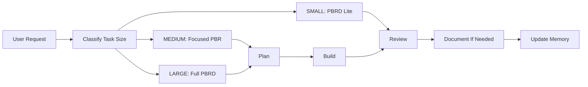

# Portable PBRD Kit

PBRD is a reusable agent workflow for software projects:

1. Plan
2. Build
3. Review
4. Document

The goal is to give AI coding agents a lightweight operating system with task sizing, memory, mistake prevention, security review, and token discipline. It is designed to work in Cursor, Claude Code or Claude terminal workflows, Codex-style terminal agents, and generic AI coding tools that read repository instructions.

## What This Kit Provides

- Cross-agent instructions for Cursor, Claude, Codex, and generic terminal AI sessions.
- `agent-system` memory templates so agents can retain project context without rereading everything.
- SMALL, MEDIUM, and LARGE task classification to avoid wasting tokens on tiny changes.
- Plan, Build, Review, and Document role instructions with hard gates.
- A lessons learned system for repeatable mistakes and prevention rules.
- An error log format for meaningful failures and risky patterns.
- SaaS security review checks for customer data exposure, tenant isolation, permissions, billing, logs, reports, and PII leakage.

## Core Workflow

## Task Sizes

**SMALL** tasks touch 1-3 files and avoid high-risk systems. Use minimal reads, a short mini-plan, targeted edits, changed-file review, and no Document pass unless user-facing behavior changed.

**MEDIUM** tasks touch 4-8 files or change a workflow. Use focused Plan, Build, and Review with relevant memory and targeted validation.

**LARGE** tasks require Full PBRD. Use this for auth, billing, Stripe, Firestore or Storage rules, customer data, tenant isolation, permissions, migrations, deletion, production deployment, security-sensitive logic, major workflows, or more than 8 files.

## Token Discipline

Agents must not read everything by default. They should:

- Read recent memory, not full memory files, unless justified.
- Search lessons by keyword before reading broad sections.
- Inspect only files relevant to the current task.
- Avoid full repo scans for SMALL work.
- Keep plans, reviews, and memory entries concise.
- Explain why a broader read is needed before doing it.

## Shared Memory Files

Install these in each project:

- `agent-system/agent-info.md`: running notebook and handoff channel.
- `agent-system/plan.md`: active approved plan and handoffs.
- `agent-system/lessons_learned.md`: durable anti-repeat mistake memory.
- `agent-system/error_log.jsonl`: append-only failure and risk log.

## Security Review

Review must explicitly check SaaS/customer-data risks when applicable:

- Customer data exposure across tenants or users.
- Org-scoped queries and strict tenant isolation.
- Role and permission enforcement for privileged actions.
- Client trust assumptions versus server, Cloud Function, or rules enforcement.
- Firestore and Storage rule coverage for touched data paths.
- Stripe webhook and billing source-of-truth boundaries.
- Data deletion, migration, export, report, log, notification, and PII leakage risks.
- Copy that overpromises compliance, privacy, security, or legal guarantees.

## Cross-Agent Coverage

Use these files depending on the tool:

- Cursor: `.cursor/rules/pbrd-lite.mdc` and `.cursor/agents/document-agent.md`.
- Claude Code or Claude terminal: `CLAUDE.md`.
- Codex or Codex-style terminal agents: `AGENTS.md` and optionally `CODEX.md`.
- Generic AI tools: `templates/terminal/terminal-startup-prompt.md`.

## Install

See `INSTALL.md` for copy steps.
